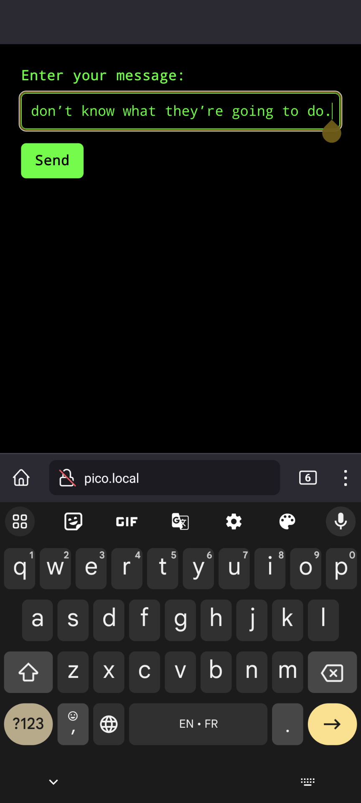

# Pico Remote Message Display

This is a hardware project that utilizes the Raspberry Pi Pico W and the Pimoroni Pico Display Pack 2.0.

The project aims to create a device that can display messages sent from a web page. The Pico will boot in Access Point (AP) mode, allowing clients to connect to it. Once connected, clients can navigate to a web page where they can send a message to be displayed on the Pico.

The Pico will print messages in the order they arrive. If there's not enough space on one screen, it will clear the screen and continue writing until the message is over.


## Hardware Requirements

- Raspberry Pi Pico W flashed with the [latest pimoroni micropython firmware](https://github.com/pimoroni/pimoroni-pico) (tested with 1.21)
- Pimoroni Pico Display Pack 2.0 (probably works with Display Pack 1 or other Pimoroni displays too)

## Development

### Dependencies

- Python 3.11 (or any version supported by the VSCode extension)
- poetry
- npm

### Build Instructions

Clone this repository and its submodule (the stubs). VSCode should then prompt you to install the recommended extensions.

To build the project:

```shell
npm ci
./pack.sh
```

Copy the files created in the `dist` folder at the root of your Pico. `main.py`` will run on boot.

A zip with the build files is also available as an artifact of the release.

## Usage

### Send messages

When you boot the Pico, it starts a wifi AP with SSID "White Rabbit", no password. Connect and visit <http://pico.local>.

From there you can dispatch messages to the Pico.

<div>
   
   
</div>
